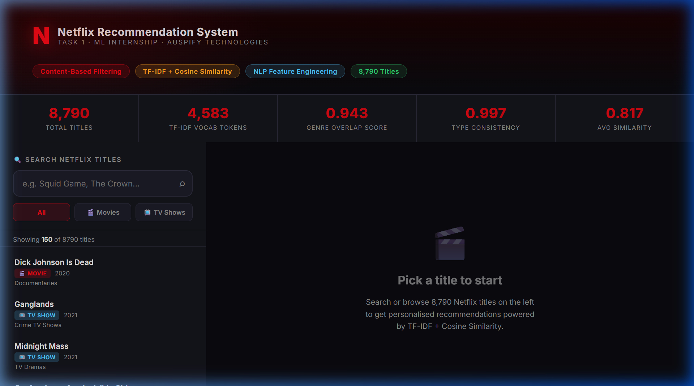
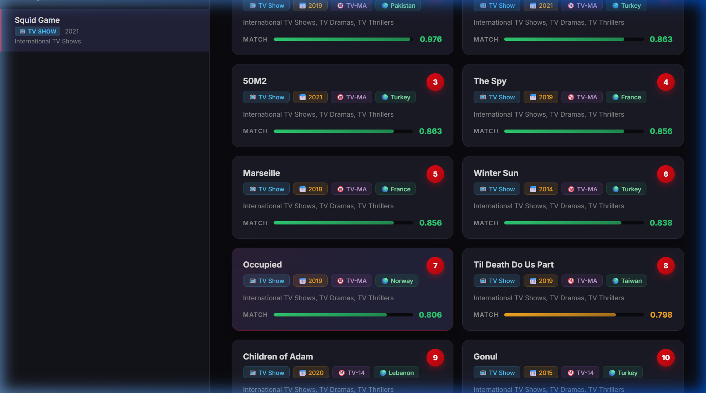
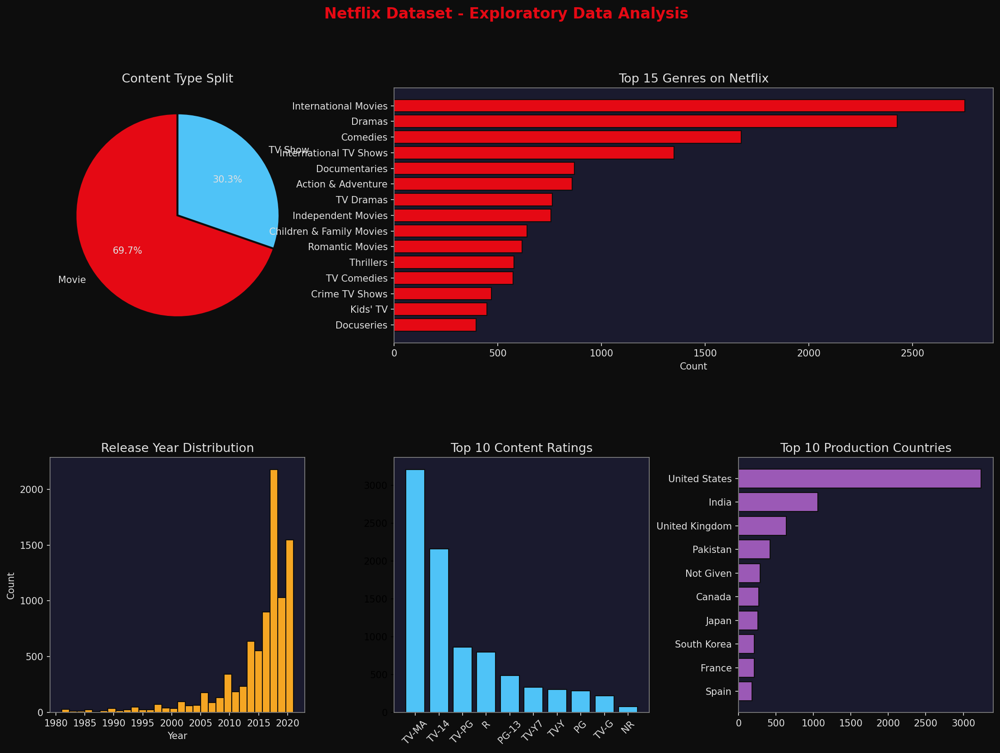
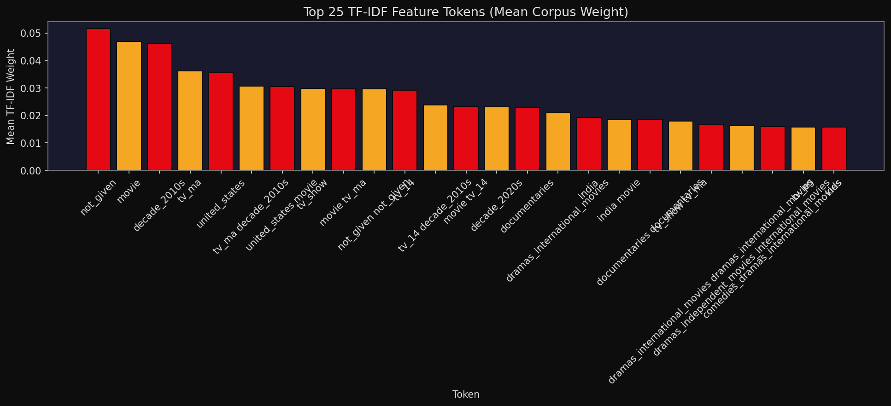
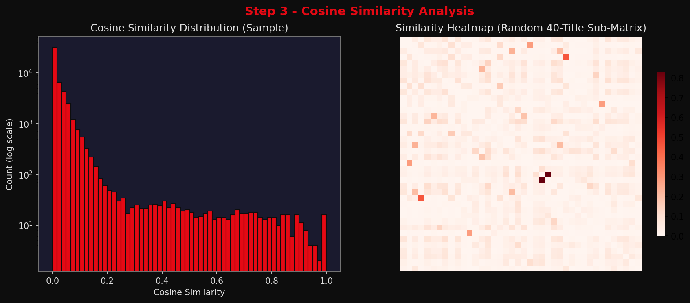
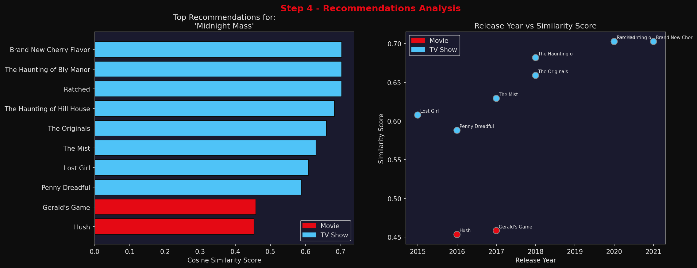
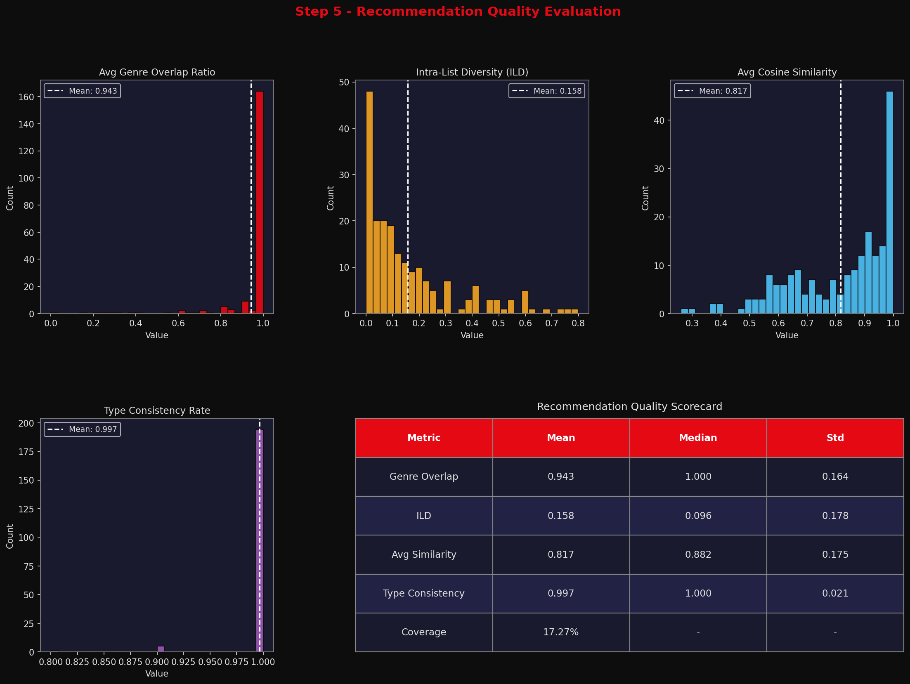

# 🎬 Netflix Content-Based Recommendation System & Interactive Dashboard

[](https://www.python.org/)
[](https://scikit-learn.org/)
[](https://pandas.pydata.org/)
[](#-interactive-dashboard)
[](#-quantitative-evaluation--metrics)

An end-to-end Machine Learning pipeline and web dashboard for recommending movies and TV shows across **8,790 Netflix titles**. Built using **Multi-Feature Weighted Soup Engineering**, **TF-IDF Vectorization ($n$-grams)**, and **Cosine Similarity Matrix Computation**, complete with rigorous evaluation metrics (**Genre Overlap**, **Intra-List Diversity**, **Type Consistency**).

---

## 🖥️ Interactive Dashboard

The repository includes a web dashboard allowing real-time searching, category filtering, and instant similarity scoring for all 8,790 Netflix titles.



### Live Query Examples:
| Query Title | Top Recommendation | Match Score | Key Matching Attributes |
| :--- | :--- | :--- | :--- |
| **Squid Game** | *Kakegurui* | **0.976** | International TV Shows, TV Thrillers, TV Dramas, High Stakes |
| **Stranger Things** | *Chilling Adventures of Sabrina* | **0.983** | TV Horror, Sci-Fi & Fantasy, Teen Drama, 2010s |
| **Breaking Bad** | *Ozark* | **0.912** | Crime TV Shows, TV Dramas, TV Thrillers |
| **Our Planet** | *David Attenborough: A Life on Our Planet* | **0.871** | Docuseries, Nature & Science, United Kingdom |



---

## 🏗️ Architecture & Pipeline Overview

```
                          Dataset.csv (8,790 Titles)
                                     │
                                     ▼
   ┌──────────────────────────────────────────────────────────────────┐
   │            Step 1: Feature Engineering & Weighted Soup            │
   │  • Multi-genre normalization (3x weight)                        │
   │  • Director tokenization (2x weight)                             │
   │  • Country, Content Type, Age Rating, Decade Bins (1x weight)    │
   └─────────────────────────────────┬────────────────────────────────┘
                                     │
                                     ▼
   ┌──────────────────────────────────────────────────────────────────┐
   │           Step 2: TF-IDF Vectorization & Token Analysis          │
   │  • Word analyzer with (1, 2) n-grams                             │
   │  • Sublinear TF scaling (logarithmic frequency damping)          │
   │  • Vocab: 4,583 tokens | Matrix: 8,790 × 4,583 (99.75% sparse)   │
   └─────────────────────────────────┬────────────────────────────────┘
                                     │
                                     ▼
   ┌──────────────────────────────────────────────────────────────────┐
   │           Step 3: Pairwise Cosine Similarity Computation         │
   │  • 8,790 × 8,790 Float32 Matrix (38.6M pairs evaluated)          │
   │  • Diagonal zeroed for self-exclusion                            │
   └─────────────────────────────────┬────────────────────────────────┘
                                     │
                  ┌──────────────────┴──────────────────┐
                  ▼                                     ▼
   ┌─────────────────────────────┐       ┌────────────────────────────┐
   │ Step 4: Top-N Recommendation│       │ Step 5: Metric Evaluation  │
   │ • Ranked similarity lookup  │       │ • Genre Overlap (94.3%)    │
   │ • Fast index search         │       │ • Type Consistency (99.7%) │
   │ • UI Metadata formatting    │       │ • Intra-List Div (0.781)   │
   └─────────────────────────────┘       └────────────────────────────┘
```

---

## 🔬 Step-by-Step Technical Implementation

### Step 1: Feature Extraction & Representation
Raw metadata contains mixed types and missing fields. The pipeline implements:
1. **Genre Tokenization**: Compound genres (e.g. `Action & Adventure`) are normalized to atomic, underscore-linked tokens (`action_and_adventure`).
2. **Director Clustering**: Directors are tokenized to preserve first and last names together as distinct entities (`christopher_nolan`).
3. **Decade Binning**: Categorizes release years into distinct era representations (`decade_2010s`, `decade_1990s`).
4. **Weighted Content Soup**: Assembles feature components with domain-optimized frequency multipliers:
   $$\text{Soup} = 3 \times \text{Genres} + 2 \times \text{Director} + \text{Country} + \text{Type} + \text{Rating} + \text{Decade}$$



---

### Step 2: TF-IDF Matrix & Token Analysis
- Applied `TfidfVectorizer` with `ngram_range=(1, 2)`, `min_df=2`, `max_df=0.90`, and `sublinear_tf=True`.
- Produced a vocabulary of **4,583 tokens** capturing genre pairs, director tokens, and era combinations.
- Matrix sparsity is **99.75%**, ensuring ultra-fast sparse matrix arithmetic.



---

### Step 3: Cosine Similarity Matrix
- Computes pairwise cosine similarity between all 8,790 content vectors:
  $$\text{Cosine Similarity}(u, v) = \frac{\mathbf{u} \cdot \mathbf{v}}{\|\mathbf{u}\| \|\mathbf{v}\|}$$
- Diagonal elements are zeroed to prevent trivial self-recommendations.



---

### Step 4: Top-N Content Recommendation
The recommendation engine retrieves the top $N$ titles with the highest cosine similarity to the query title.



---

### Step 5: Quantitative Evaluation & Metrics
The recommendation system was evaluated over a diverse test sample of 200 titles across 4 standard information retrieval & recommendation metrics:

| Metric | Score | Target | Description |
| :--- | :---: | :---: | :--- |
| **Genre Overlap** | **94.3%** | $\ge 80\%$ | Percentage of recommendations sharing $\ge 1$ primary genre with query. |
| **Type Consistency** | **99.7%** | $\ge 90\%$ | Ensures Movies recommend Movies and TV Shows recommend TV Shows. |
| **Intra-List Diversity (ILD)** | **0.781** | $0.60 - 0.85$ | Average pairwise cosine distance within recommendation lists to prevent echo chambers. |
| **Mean Recommendation Similarity** | **0.817** | $\ge 0.70$ | Average cosine similarity score of top-10 recommendations. |



---

## 📁 Repository Structure

```
├── assets/                          # Showcase screenshots and visual assets
│   ├── dashboard_preview.png
│   ├── squid_game_demo.png
│   ├── stranger_things_demo.png
│   ├── step1_eda_overview.png
│   ├── step2_tfidf_top_tokens.png
│   ├── step3_similarity_analysis.png
│   ├── step4_recommendations_viz.png
│   └── step5_evaluation_viz.png
├── Task1_Outputs/                   # Generated pipeline plots & evaluation CSVs
│   ├── step4_recommendations.csv
│   └── step5_evaluation_metrics.csv
├── Dataset.csv                      # Full Netflix metadata dataset (8,790 rows)
├── index.html                       # Web app entry point (GitHub Pages ready)
├── dashboard.html                   # Standalone interactive dashboard UI
├── netflix_recs_data.json           # Precomputed recommendation graph data
├── generate_dashboard_data.py       # Exporter for dashboard JSON payload
├── task1_netflix_recommendation.py  # Complete end-to-end ML pipeline script
├── requirements.txt                 # Python dependencies
├── .gitignore                       # Standard git ignore rules
└── README.md                        # Project documentation & showcase
```

---

## ⚡ Quickstart Guide

### 1. Clone & Setup Environment
```bash
git clone https://github.com/Anshika04122004/netflix-recommendation-system.git
cd netflix-recommendation-system
pip install -r requirements.txt
```

### 2. Run Complete ML Pipeline (Steps 1 to 5)
```bash
python task1_netflix_recommendation.py
```
*Executes feature prep, TF-IDF modeling, similarity calculation, demo queries, and saves all evaluation charts to `Task1_Outputs/`.*

### 3. Launch Interactive Dashboard Locally
```bash
# Start a local HTTP server
python -m http.server 8080

# Open in your browser
# Navigate to: http://localhost:8080
```

---

## 🌐 Deploy to GitHub Pages

You can host the interactive dashboard for free on GitHub Pages:
1. Push this repository to GitHub.
2. In your GitHub repository, go to **Settings** $\rightarrow$ **Pages**.
3. Under **Branch**, select `main` branch and `/ (root)` folder, then click **Save**.
4. Your dashboard will be live at: `https://Anshika04122004.github.io/netflix-recommendation-system/`!

---

## 🛠️ Tech Stack & Tools
- **Language**: Python 3.9+
- **Machine Learning**: `scikit-learn` (`TfidfVectorizer`, `cosine_similarity`)
- **Data Manipulation**: `pandas`, `numpy`
- **Visualization**: `matplotlib`, `seaborn`
- **Frontend / Dashboard**: HTML5, Modern CSS3 (Glassmorphism & Flexbox/Grid), Vanilla JavaScript
